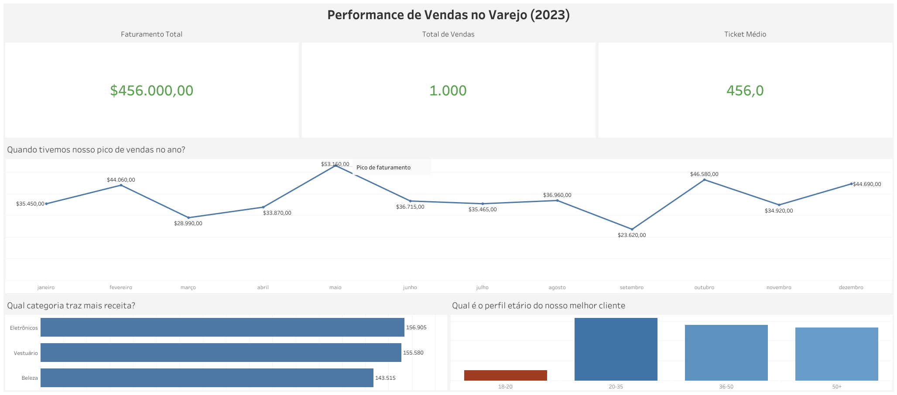

# 📊 Retail Sales Analysis: SQL + Tableau Performance Dashboard

Este repositório apresenta um projeto de **Business Intelligence** ponta a ponta. A partir de um dataset bruto de varejo, realizei a modelagem de dados via SQL para construção de uma camada analítica, culminando em um dashboard executivo interativo no Tableau para suporte à tomada de decisão.

## 📈 Dashboard Executivo (Tableau)
A visão final e interativa deste projeto está publicada e acessível na nuvem:
👉 **[Acessar o Painel Interativo de Vendas](https://public.tableau.com/views/PerformancedeVendasnoVarejo2023/PerformancedeVendasnoVarejo2023?:language=pt-BR&:sid=&:redirect=auth&:display_count=n&:origin=viz_share_link)**

## 💡 Insights e Recomendações de Negócio

O faturamento total analisado foi de **$456.000,00**, com um ticket médio saudável de **$456,00** por transação. Através da exploração visual e em SQL, mapeamos as seguintes alavancas de negócio:

1. **O Everest de Maio (Sazonalidade):** * *Diagnóstico:* O mês de Maio apresentou um pico de vendas anômalo ($53.150), muito acima da média anual, seguido de uma queda brusca no meio do ano.
   * *Ação Recomendada:* Investigar junto ao time de Marketing quais campanhas rodaram em Maio (ex: Dia das Mães) e tentar replicar o modelo de aquisição para aquecer o Q3 (Julho a Setembro).
2. **A Força dos Eletrônicos (Mix de Categorias):** * *Diagnóstico:* A categoria de **Eletrônicos** lidera a receita, mas é seguida de muito perto por Vestuário e Beleza.
   * *Ação Recomendada:* Como não há um monopólio de um único produto, existe uma oportunidade de ouro para estratégias de *Cross-Sell* (ex: "Compre um smartphone e ganhe 15% em roupas e acessórios").
3. **A Geração Z e Millennials (Perfil Demográfico):** * *Diagnóstico:* O público na faixa de **20 a 35 anos** representa a fatia esmagadora do faturamento da empresa.
   * *Ação Recomendada:* Redirecionar a verba de tráfego pago para canais digitais de retenção forte para esse público (TikTok, Instagram) e criar programas de fidelidade (LTV) focados em tecnologia e moda.

## 🚀 Estrutura do Projeto e Pipeline

A arquitetura foi desenhada para garantir reprodutibilidade e organização profissional:
* **/sql_scripts**: Pipeline de dados contendo:
  * `01_schema.sql`: DDL para criação da estrutura do banco e tipagem de dados.
  * `02_view_tableau.sql`: Criação da View `vw_dashboard_vendas` (Camada Semântica com regras de negócio).
  * `03_business_queries.sql`: Consultas exploratórias avançadas para validação matemática.
* **/outputs**: Base consolidada `dados_para_tableau.csv` consumida pelo dashboard.
* **/docs**: Evidências visuais.

> **Nota de Arquitetura:** A modelagem no PostgreSQL manteve os nomes originais em inglês (preservando a integridade do dataset global original), enquanto a camada de visualização (Front-end no Tableau) foi totalmente traduzida e adaptada para o usuário final em Português.

## 📂 Fonte dos Dados

Os dados brutos foram obtidos através do **Kaggle** ([Retail Sales Dataset](https://www.kaggle.com/datasets/mohammadtalhasardar/retail-sales-dataset)). Este dataset simula transações de varejo contendo informações demográficas de clientes, categorias de produtos e valores de compra.

## 🏁 Guia de Execução Técnica

Para reproduzir o back-end deste projeto na sua máquina local:
1. Clone o repositório: `git clone https://github.com/Mpierredev/analise-vendas-sql.git`
2. Crie um banco PostgreSQL chamado `retail_db`.
3. Execute o script `01_schema.sql` e faça a ingestão do dataset localizado na pasta raiz.
4. Rode `02_view_tableau.sql` para gerar a camada de visualização.

---
*Projeto desenvolvido por Márcio Pierre para portfólio de Data Analytics / B.I.*